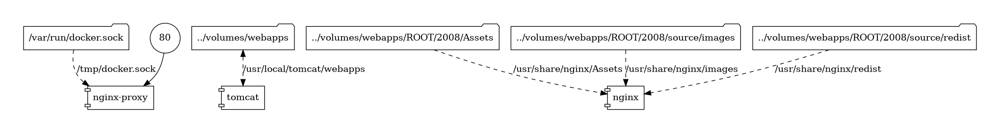

# Hofmeister XIX

The Hofmeister XIX project is a [TEI XML](https://tei-c.org/)-based project
published via, [Apache Cocoon](https://cocoon.apache.org/), a
[Tomcat](https://tomcat.apache.org/) web application. Recently, the project has
been containerised using [Docker Compose](https://docs.docker.com/compose/) to
enhance deployment efficiency and sustainability. The containerised setup
comprises three main services: an
[nginx proxy](https://github.com/nginx-proxy/nginx-proxy), a Tomcat server, and
an [nginx](https://www.nginx.com/) server.



1. [`nginx-proxy`](https://hub.docker.com/r/nginxproxy/nginx-proxy): This
   service acts as a reverse proxy, dynamically routing incoming HTTP requests
   to the appropriate backend services based on the requested hostname and path.
   It ensures that traffic is directed correctly and efficiently within the
   application infrastructure.
1. [`tomcat`](https://hub.docker.com/_/tomcat): This service hosts the
   Java-based web application. It is responsible for processing and delivering
   dynamic content generated from the TEI XML data. The Tomcat server is
   configured to handle substantial traffic and resource-intensive operations.
1. [`nginx`](https://hub.docker.com/_/nginx): This service is dedicated to
   serving static assets, images, and other resources required by the web
   application. By offloading the delivery of static content to a separate
   server, it improves the overall performance and responsiveness of the web
   application.

## Get Started

Follow these steps to set up and run the Hofmeister XIX project using Docker
Compose.

**Note** that these instructions cover only the local setup; server deployment is not covered here.

### Pre-requisites

Before you begin, ensure you have the following installed on your system:

- [Docker](https://www.docker.com/products/docker-desktop/)
- [Docker Compose](https://docs.docker.com/compose/)

### Running the application

1. **Clone this repository**
1. **Start the services**

   Use the provided helper script `docker.sh` to build and start the services:

   ```bash
   ./docker.sh
   ```

1. **Access the application**

   Once all services are running, you can access the web application via your web browser at [http://localhost/](http://localhost/).

To stop the application press CTRL+C in the same terminal window where the `docker.sh` script is running.
